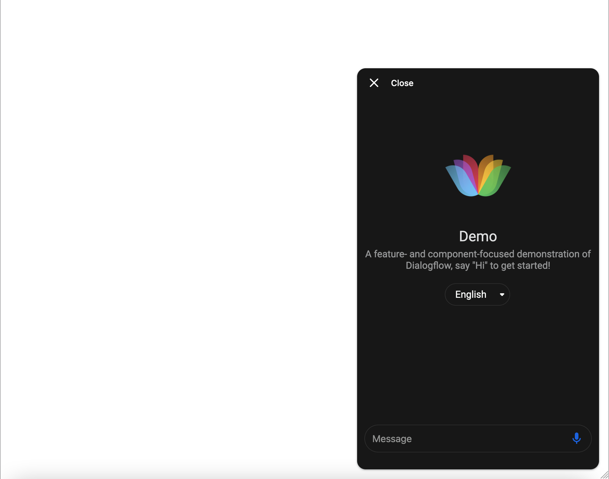
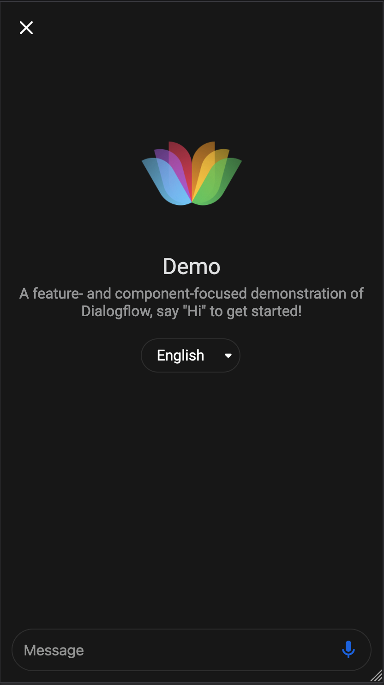
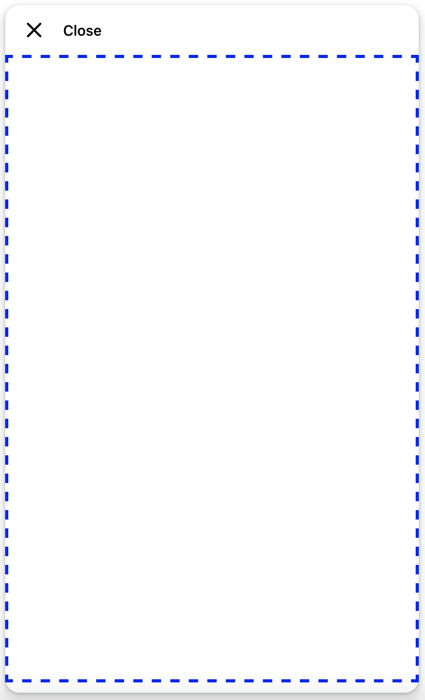

# Floating Chat web component





[Demo](https://mishushakov.github.io/floating-chat)

A framework-independent floating chat window web component written in [Svelte](https://github.com/sveltejs/svelte)

The primary purpose of it is embedding engageable content, in particular: helpdesks, chatbots or anything else that requires a floating box

Features:

- Cross-framework integration (esmodule & umd)
- Responsive UI with animations
- Accessibility features
- Customisation options as well
- Custom javascript events

## Installation

### Browser

Add the following script to your `<head>`

```html
<script defer src='https://unpkg.com/floating-chat@latest/dist/index.js'></script>
```

### Using NPM

Install the `floating-chat` package

```sh
npm i floating-chat
```

Then import into your application with

```js
import floatingChat from 'floating-chat'
```

Add the tag to your template

```html
<floating-chat content="https://example.com" />
```

You can see the demo example in [public/index.html](public/index.html)

## Customisation



Content area

### HTML properties

Available attributes:

- `content`, content address (to be displayed in `<iframe>`)
- `height`, floating window height, default `600px`, always `100%` on mobile
- `width`, floating window width, default `400px`, always `100%` on mobile
- `textOpen`, text when the window is closed, default `Open`, hidden on mobile
- `textClose`, text when the window is opened, default `Close`, hidden on mobile
- `textColor` - the colour of text, default `#000000` (black)
- `background` - background color, can be either a color code or a css `background` property, default `#FFFFFF` (white)
- `logo` - logo url, css `background` property, eg `url(https://storage.googleapis.com/cloudprod-apiai/a0b2e356-b43e-4ca5-a094-b219475fa4ca_x.png)`
- `position` - y, x position on screen, default `bottom right`, possible options `bottom`, `top`, `left`, `right`
- `font` - font name
- `borderRadius` - corner radius, default `28px`, `0px` on mobile when opened
- `opened` - boolean, whether floating window should start opened, default `false`

### Styling with CSS variables

Available variables:

- `--height`, floating window height, default `600px`, always `100%` on mobile
- `--width`, floating window width, default `400px`, always `100%` on mobile
- `--textcolor` - the colour of text, default `#000000` (black)
- `--background` - background color, can be either a color code or a css `background` property, default `#FFFFFF` (white)
- `--logo` - logo url, css `background` property, eg `url(https://storage.googleapis.com/cloudprod-apiai/a0b2e356-b43e-4ca5-a094-b219475fa4ca_x.png)`
- `--positiony` - y position on screen, default `bottom`
- `--positionx` - x position on screen, default `right`
- `--font` - font name
- `--borderradius` - corner radius, default `28px`, `0px` on mobile when opened

## Events

Following events are emmited:

- `open`, when the floating window state went from closed to open
- `close`, when the floating window state went from open to closed
- `toggle`, when the floating window state was toggled

Example in Vue:

```html
<template>
  <floating-chat @open="open" />
</template>

<script>
export default {
  methods: {
    open () {
      alert('Opened!')
    }
  }
}
</script>
```

## Development

1. Clone the repository

    ```
    git clone https://github.com/mishushakov/floating-chat.git
    ```

2. Install the dependencies

    ```
    npm i
    ```

3. Build

    ```
    npm run build
    ```

## Acknowledgements

- [Icons by Feather](https://github.com/feathericons/feather)
